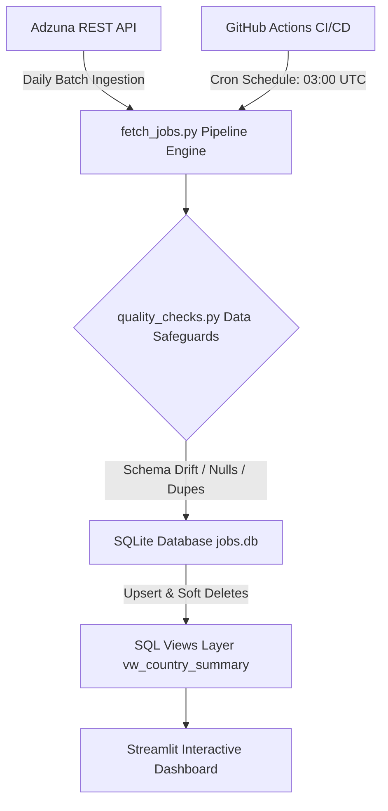

# 💼 Global Job Market Intelligence & Automated Data Pipeline

[](https://python.org)
[](https://sqlite.org)
[](https://streamlit.io)
[](https://plotly.com)
[](https://github.com/features/actions)

An end-to-end, self-refreshing data pipeline and interactive analytics dashboard that ingests, cleanses, normalizes, and analyzes multi-country job postings for **Data Analytics** and **Data Engineering** roles.

---

## 📌 Executive Summary & Business Value

Job market demand changes rapidly across geographies, compensation tiers, and required skill sets. This project provides an automated, production-grade intelligence pipeline that:
- **Ingests live job postings** from 6 major economies (🇮🇳 India, 🇺🇸 United States, 🇬🇧 United Kingdom, 🇨🇦 Canada, 🇦🇺 Australia, 🇸🇬 Singapore).
- **Enforces Data Quality (DQ) checks** including schema drift protection, duplicate handling, and null validation before committing to storage.
- **Models historical job dynamics** using soft deletes (`is_active = 0`) to track job posting longevity and expiration rates without data loss.
- **Normalizes global compensation** into standardized USD ($) metrics for apples-to-apples cross-border salary benchmarking.
- **Extracts in-demand technical skills** (SQL, Python, Power BI, Tableau, AWS, dbt, etc.) directly from job titles and descriptions.

---

## 🏗️ Architecture & Data Flow



### Pipeline Workflow:
1. **Scheduled Ingestion**: GitHub Actions triggers `fetch_jobs.py` daily via cron schedule.
2. **Quality Audit**: `quality_checks.py` validates incoming payloads against expected key schemas, flags missing fields, and detects batch duplicates.
3. **Idempotent Storage**: `jobs.db` receives clean rows via primary key (`posting_id`) upserts—updating `last_seen_at` for active jobs.
4. **Soft Deletion**: Postings absent from recent API responses are transitioned to `is_active = 0`, retaining historical records for trend analysis.
5. **Analytical Serving**: Streamlit reads directly from SQLite, rendering executive KPIs, salary distributions, tech stack demand, and pipeline operational health logs.

---

## 💡 Key Analytical Insights & Features

### 1. Global Compensation Benchmarking (USD Normalized)
- Converts local currencies (`INR`, `GBP`, `AUD`, `CAD`, `SGD`) to USD using standardized FX rates.
- Displays distribution boxplots to contrast minimum/maximum salary floors between Data Analysts and Data Engineers.

### 2. Tech Stack & Skill Demand Extraction
- Automatically parses job postings to quantify demand for key data tools (`SQL`, `Python`, `Power BI`, `Tableau`, `Excel`, `AWS`, `Spark`, etc.).

### 3. Pipeline Operations & SLA Monitoring
- Tracks batch execution status (`success`, `partial`, `failed`), rows inserted vs refreshed vs deactivated, and logs error messages for complete pipeline observability.
- Alerts on data staleness if automated sync exceeds 36 hours.

---

## 🛠️ Data Modeling & Database Schema

### `postings` Table
| Column Name | Type | Description |
| :--- | :--- | :--- |
| `posting_id` | TEXT (PK) | Unique job identifier from Adzuna API |
| `country_code` | TEXT | ISO country code (e.g., `us`, `in`, `gb`) |
| `title` | TEXT | Cleaned job posting title |
| `company` | TEXT | Hiring organization |
| `location` | TEXT | Geographic city / region |
| `salary_min` / `salary_max` | REAL | Reported salary range |
| `currency` | TEXT | Native local currency |
| `first_seen_at` / `last_seen_at` | TEXT (ISO) | Timestamps tracking listing active lifespan |
| `is_active` | INTEGER | `1` = Active listing, `0` = Soft-deleted / Expired |

### SQL View Layer
- `vw_country_summary`: Aggregates active postings, salary ranges, and compensation disclosure rates per country.
- `vw_pipeline_health_summary`: Summarizes historical pipeline run performance and data modification volumes.

---

## ⚡ Resilience & Failure Modes

For complete documentation on pipeline error handling, rate limiting (HTTP 429), schema drift halts, and operational recovery, see [`FAILURE_MODES.md`](FAILURE_MODES.md).

---

## 🚀 Local Setup & Execution Guide

### Prerequisites
- Python 3.10+
- Adzuna API Credentials (`APP_ID` & `APP_KEY`)

### 1. Clone Repository & Install Dependencies
```bash
git clone https://github.com/your-username/job-market-pipeline.git
cd job-market-pipeline
python -m venv venv
source venv/bin/activate  # On Windows: venv\Scripts\activate
pip install -r requirements.txt
```

### 2. Configure Environment Variables
Copy `.env.example` to `.env` and insert your Adzuna API keys:
```env
ADZUNA_APP_ID=your_adzuna_app_id
ADZUNA_APP_KEY=your_adzuna_app_key
```

### 3. Initialize Database & Run Pipeline
```bash
# Create SQLite tables, indexes, and analytical views
python init_db.py

# Ingest live job data across configured countries
python fetch_jobs.py
```

### 4. Launch Streamlit Analytics Dashboard
```bash
streamlit run app.py
```

---

## 📄 License
Distributed under the MIT License. See `LICENSE` for details.
